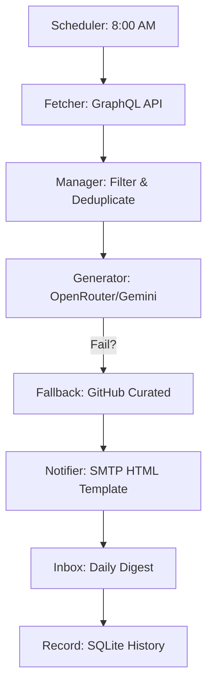

# 🚀 LeetCode AutoPilot

> **Stop the scroll. Start the solve.** 

LeetCode AutoPilot is a high-performance automation engine designed for the disciplined developer. It eliminates the friction of manual problem hunting by delivering a curated set of challenges, AI-optimized solutions, and clean technical documentation directly to your inbox every single morning.

[](https://www.python.org/downloads/)
[](https://openrouter.ai/)
[](https://www.sqlite.org/)

---

## ✨ Why AutoPilot?

Consistency is the ultimate differentiator in technical interviews. But finding the "right" problem every day is a chore. 

**AutoPilot does the work for you:**
- 📡 **Smart Fetching**: Pulls directly from LeetCode’s GraphQL API—no messy scraping.
- 🧠 **Triple-Layer Intelligence**: 
    1. **Primary**: OpenRouter (Gemini 2.0 Flash/GPT-4o)
    2. **Secondary**: Native Google Gemini SDK
    3. **Fail-safe**: Curated GitHub solution fallback (walkccc)
- 📧 **Minimalist Digest**: High-signal, low-noise emails. Just the Link and the Solution. Zero clutter.
- 🔄 **Anti-Duplication**: Built-in SQLite history tracking ensures you never see the same problem twice.

---

## 🛠️ Architecture



---

## ⚡ Quick Start

### 1. Clone & Install
```bash
git clone https://github.com/yourusername/LeetcodeAutomation.git
cd LeetcodeAutomation
pip install -r requirements.txt
```

### 2. Configure Your Cockpit
Copy `.env.example` to `.env` and arm the keys:
```env
OPENROUTER_API_KEY=your_key_here
EMAIL_SENDER=your_email@gmail.com
EMAIL_PASSWORD=your_app_password
```

### 3. Ignition
```bash
python main.py
```

---

## 📬 Example Daily Digest

**Subject:** Daily LeetCode Practice – 5 Problems with Python Solutions

**Problem: Two Sum**
[leetcode.com/problems/two-sum](https://leetcode.com/problems/two-sum)

**Python Solution:**
```python
def twoSum(nums, target):
    seen = {}
    for i, n in enumerate(nums):
        diff = target - n
        if diff in seen:
            return [seen[diff], i]
        seen[n] = i
```

---

## 🛡️ License
Built for the community. Use it, break it, solve.

**Happy Coding.** 🚀
